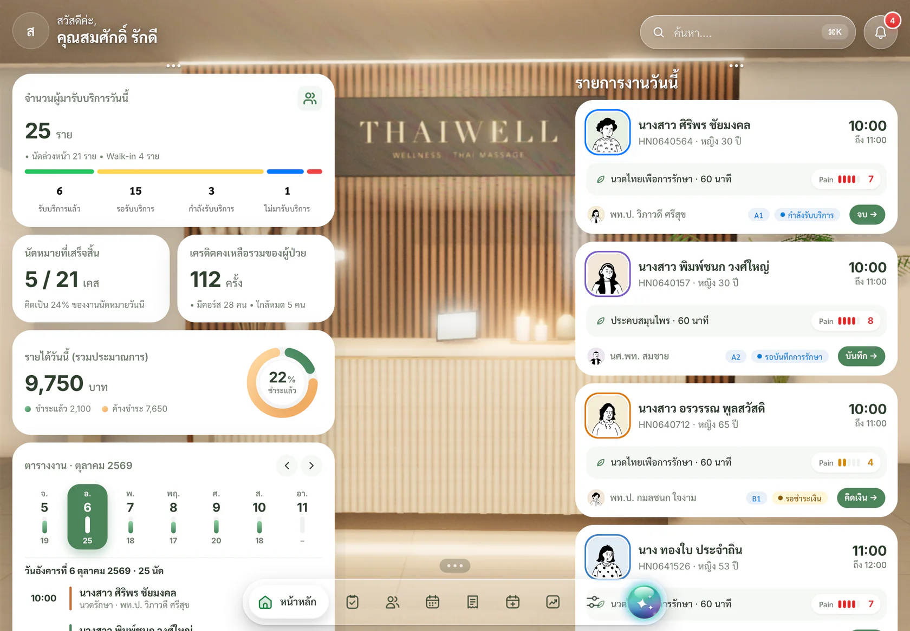
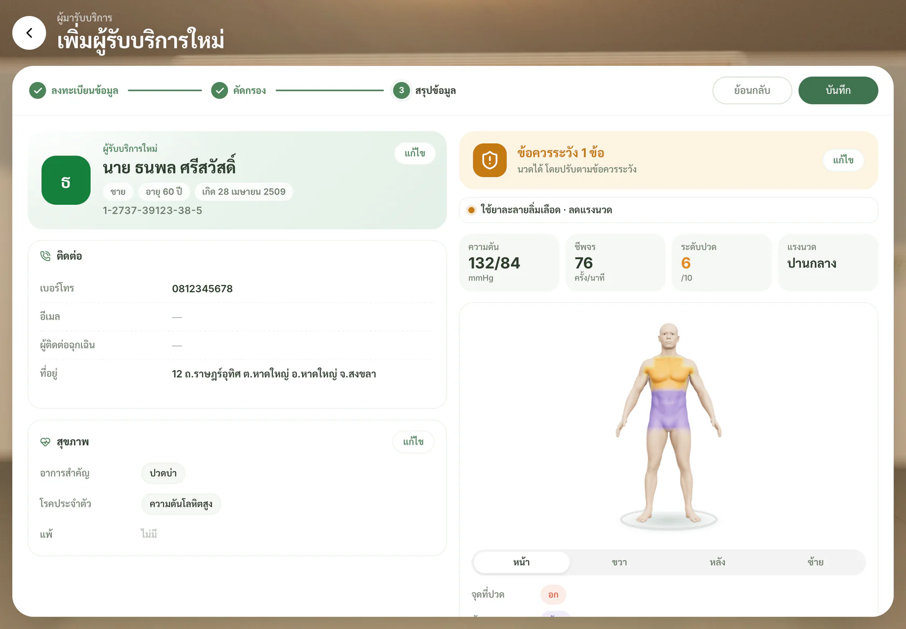
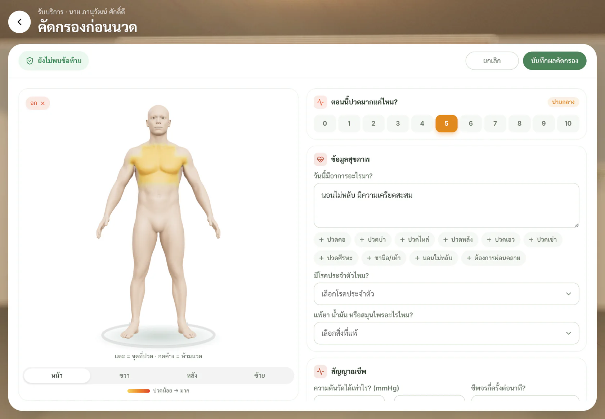
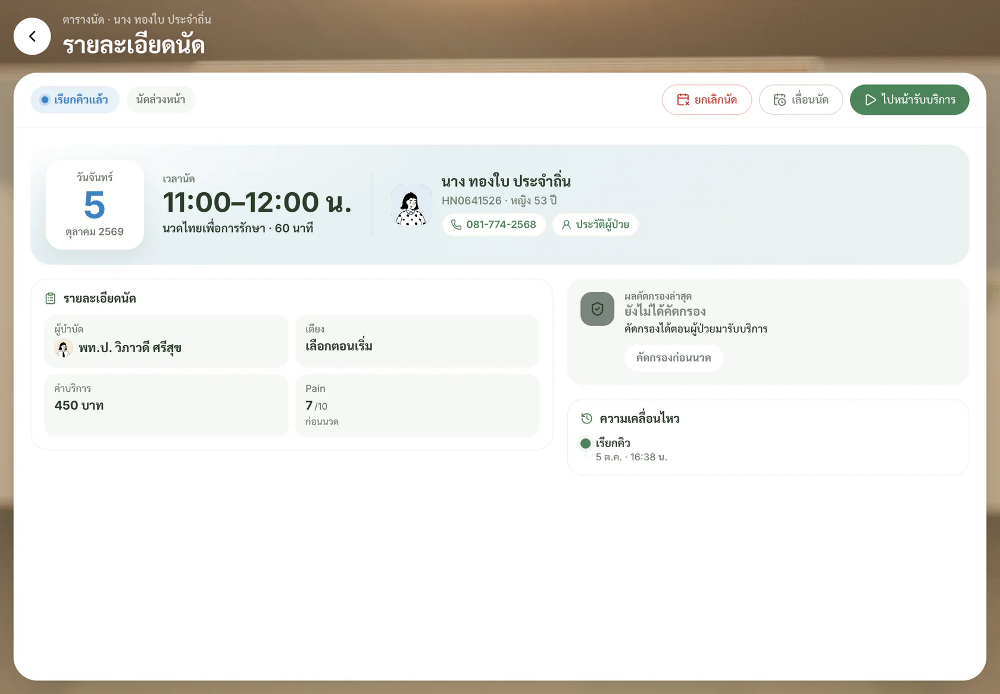

# ThaiWell · ระบบหลังบ้านคลินิกแพทย์แผนไทย

ระบบหลังบ้านสำหรับคลินิกนวดและแพทย์แผนไทย ครอบคลุมงานตั้งแต่ลงทะเบียนด้วยบัตรประชาชนไปจนถึงออกใบเสร็จ ได้แก่:
- คัดกรองก่อนนวดด้วยหุ่น 3D
- เรียกคิว บันทึกการรักษา และรับชำระเงิน
- วิเคราะห์ธาตุเจ้าเรือน
- ร่างแผนการรักษาด้วย AI ให้แพทย์แผนไทยตรวจอนุมัติ

ออกแบบให้ใช้งานบน iPad เป็นหลัก ทั้งแนวนอนและแนวตั้ง

| | ลิงก์ |
|---|---|
| **Prototype (ใช้งานได้จริง)** | https://thaiwellai-svg.github.io/ThaiWellAI/ |
| **คู่มือการใช้งาน** | https://thaiwellai-svg.github.io/ThaiWellAI/tutorial/ |
| **Git repository** | https://github.com/thaiwellai-svg/ThaiWellAI |

> ข้อมูลทั้งหมดในระบบเป็นข้อมูลสมมติ ไม่มีข้อมูลสุขภาพของบุคคลจริง
>
> ระบบบันทึกข้อมูลไว้ในเบราว์เซอร์ของเครื่องที่เปิดใช้เท่านั้น สำรองหรือกู้คืนได้ที่ **ตั้งค่า → ข้อมูลและการสำรอง**



---

## ฟีเจอร์หลัก

### 💡 นวัตกรรม

- **แดชบอร์ดผลการรักษา (Real-world evidence):** ใช้ Pain ก่อน/หลังนวดทุกครั้งที่บันทึก สรุปว่าปวดลดเท่าไร (95% CI) สัดส่วนที่ดีขึ้นอย่างมีนัยสำคัญทางคลินิก (ลด ≥ 2 คะแนน) แยกตามบริการ อาการ และ ธาตุ × บริการ ระบบเขียนข้อค้นพบเป็นภาษาธรรมดา และส่งออก CSV สำหรับงานวิจัยแบบไม่ระบุตัวตน
- **สมุฏฐานวินิจฉัย 5 ด้าน:** ธาตุ (เดือนเกิด) อายุ ฤดู เวลา และถิ่นที่อยู่ (จากที่อยู่ในบัตร) รวมกับอาการวันนี้ สรุปธาตุที่เสี่ยงเสียสมดุล พร้อมแนวทางนวด ประคบ สมุนไพร สิ่งที่ควรเลี่ยง และบริการที่ได้ผลดีที่สุดกับผู้ป่วยธาตุเดียวกันจากข้อมูลจริงของคลินิก
- **AI วางแผนจากหลักฐาน:** ส่งสมุฏฐานและผลจริงของคลินิกให้ AI ใช้ประกอบการร่างแผนการรักษา
- **ผู้ช่วยบันทึกการรักษา (AI):** แชทกับ AI ด้วยข้อความหรือเสียง (ข้อความขึ้นสดขณะพูด หยุดพูดแล้วส่งเอง AI ตอบกลับทั้งเสียงและข้อความ) ถามตามชุดคำถาม 5 ข้อ: อาการที่ตรวจพบ → วินิจฉัย → หัตถการ → Pain หลังนวด → คำแนะนำ
  - AI ใช้ข้อมูลที่คนไข้แจ้งมา ผลคัดกรอง ประวัติครั้งก่อน ธาตุ และผลจริงของคลินิก เพื่อเสนอคำตอบแต่ละข้อ ผู้บำบัดแค่ตอบ “ใช่” หรือแก้ส่วนที่ต่าง
  - หัตถการระบุตำแหน่งบนหุ่น 3D ด้วยคำพูด (หลายจุด ขึ้นเป็น heatmap) เตือนเมื่อตรงจุดที่คนไข้ไม่ให้นวด
  - AI แก้คำที่ถอดเสียงผิดตามศัพท์แพทย์แผนไทย จำสิ่งที่พูดล่วงหน้าแล้วถามยืนยันทีหลัง พิมพ์ชื่อหัวข้อเพื่อเปิด/แก้หัวข้อนั้นได้ ร่างคำแนะนำถึงผู้ป่วยที่แก้ได้ และบันทึกจากการ์ดสรุปในแชท

### 🧾 ลงทะเบียนและคัดกรอง

ลงทะเบียนเป็น 3 ขั้นตอน คือ ลงทะเบียน → คัดกรอง (ข้ามได้) → สรุป

- **อ่านบัตรประชาชน:** กรอกข้อมูลให้อัตโนมัติ มีอนิเมชั่นเครื่องอ่านบัตร
- **ตรวจเลขบัตร:** ตรวจ checksum ของเลขบัตร และกันการลงทะเบียนซ้ำ
- **หุ่น 3D:** แตะ = จุดที่ปวด · กดค้าง = ห้ามนวด
- **ข้อมูลสุขภาพ:** ระดับปวด 0–10, โรคประจำตัวและการแพ้แบบเลือกได้หลายรายการ, สัญญาณชีพ และคำถามก่อนนวดแบบ ใช่ / ไม่ใช่
- **หน้าสรุป:** แสดงผลคัดกรอง (ผ่าน / ระวัง / ห้ามนวด) และวิเคราะห์ธาตุเจ้าเรือนเทียบกับอาการวันนี้



### 💆 รับบริการหน้างาน

- ลำดับงาน: เรียกคิวพร้อมเสียงประกาศ → **คัดกรองก่อนนวดทุกครั้ง** (หน้าคัดกรองแบบเดียวกับตอนลงทะเบียน) → เลือกเตียง → จับเวลา
- บันทึกการรักษาพร้อมรหัส **ICD-10 / ICD-9-CM อัตโนมัติ** และ Pain Score ก่อน–หลังนวด
- รับชำระด้วยเงินสด พร้อมเพย์ (QR) บิลในแอป หรือหักเครดิตคอร์ส แล้วออกใบเสร็จ
- เตือนข้อห้ามจากการคัดกรองบนหน้าผู้ป่วยและระหว่างรับบริการ



### 👤 ผู้มารับบริการ

- ค้นหาด้วยชื่อ HN เบอร์โทร หรือเลขบัตรประชาชน หรือเสียบบัตรเพื่อเปิดประวัติทันที
- ข้อมูลสุขภาพบนหุ่น 3D: บริเวณที่ควรเน้น บริเวณห้ามนวด และประวัติ Pain Score
- **ธาตุเจ้าเรือน** ตามเดือนเกิด พร้อมแนวทางนวดและรสยาที่เหมาะ
- **แผนการรักษาโดย AI:**
  - อ่านอาการ ประวัติ ธาตุ และเอกสารที่แนบ (OCR)
  - ร่างแผนนวด ประคบ สมุนไพร และท่าฤาษีดัดตน
  - แพทย์แผนไทยตรวจอนุมัติ แล้วจองนัดตามแผนได้
- พิมพ์หรือบันทึก PDF ใบสรุปผลคัดกรองและแผนการรักษา



### 📅 อื่น ๆ

- **ตารางนัด:** นัดรายวันแยกตามผู้บำบัด เพิ่มคิวนัดล่วงหน้าหรือ Walk-in
- **หน้ารายละเอียดนัด:** สถานะ ผู้ป่วย ผู้บำบัด เตียง แผนการรักษา (ครั้งที่ x จาก N) ผลคัดกรอง และไทม์ไลน์ของนัด · เลื่อนนัดได้
- **ยกเลิกนัด:** ระบุผู้ยกเลิกและเหตุผล คืนเตียงและเครดิตคอร์สอัตโนมัติ ยกเลิกใบเสร็จถ้าชำระแล้ว เลิกทำได้ · นัดในแผนการรักษาเลือกยกเลิกเฉพาะนัดนี้ / บางวัน / ทั้งหมดได้
- **จัดตารางงาน:** เส้นเวลาของผู้บำบัด และกำหนดวันเวลาทำงาน
- **คิดเงิน:** ยอดรับชำระ ใบเสร็จ ยกเลิกและคืนเงิน (คืนเครดิตอัตโนมัติ) และส่งออกรายงาน CSV
- **รายการรอคิว:** จดชื่อคนที่รอคิวว่าง เมื่อมีคนยกเลิกนัดในช่วงเวลานั้น ระบบแจ้งคนที่รอให้อัตโนมัติ และจองให้ได้ทันที
- **คำขอจองคิวจากแอปผู้ป่วย:** ตรวจผลคัดกรองที่ผู้ป่วยทำมา แล้วอนุมัติหรือปฏิเสธ
- **ใบกำกับภาษีเต็มรูป:** สำหรับคลินิกที่จด VAT ออกจากใบเสร็จได้ แยกมูลค่าก่อนภาษีและ VAT พร้อมเลขที่ TX
- **ปิดยอดประจำวัน:** นับเงินสดตามแบงก์/เหรียญ เทียบยอดในระบบ แสดงเงินขาด/เกิน บันทึกยอดนำฝากธนาคาร พิมพ์ใบปิดยอด
- **ค่ามือผู้บำบัด:** สรุปเคส รายได้ และค่ามือรายเดือน (บาท/เคส + % ของรายได้) แก้อัตราได้ ส่งออก CSV
- **คอร์สและแพ็กเกจ:** ตั้งราคาแพ็กเกจ ส่วนลดสมาชิก ขายคอร์สจากหน้าผู้ป่วย รับมัดจำและรับชำระคงค้าง
- **คลังสินค้า:** ลูกประคบ น้ำมัน สมุนไพร รับเข้า ปรับยอด แจ้งใกล้หมด และตัดสต็อกอัตโนมัติตามบริการเมื่อบันทึกการรักษา
- **ใบรับรองแพทย์ / ใบส่งตัว:** เติมการวินิจฉัยจากการรักษาล่าสุด มีเลขที่เอกสาร พิมพ์และพิมพ์ซ้ำได้
- **ผู้ช่วย AI:** ถามเรื่องคิว เครดิต หรือสรุปอาการได้ทุกหน้า มีประวัติแชท
- **ตั้งค่า:**
  - เวลาทำการ ห้องและเตียง บริการและราคา
  - เกณฑ์คัดกรองความปลอดภัย
  - พร้อมเพย์ของคลินิก
  - ประวัติการแก้ไข (audit log)
  - สำรองและกู้คืนข้อมูล
- **คู่มือการใช้งาน:**
  - คู่มือแนะนำเมนูแบบไฟส่องสำหรับผู้ใช้ครั้งแรก
  - คู่มือทีละขั้นในแอป
  - เว็บคู่มือฉบับเต็มพร้อมภาพเคลื่อนไหวสาธิตการกด

---

## คู่มือการใช้งาน

https://thaiwellai-svg.github.io/ThaiWellAI/tutorial/

- รวม 13 หัวข้อ แยกตามเมนูของแอป และค้นหาได้
- แต่ละหัวข้อเขียนเป็นบทความทีละขั้น
- ทุกขั้นมีภาพเคลื่อนไหวสาธิตว่าต้องกดตรงไหน ภาพมาจากหน้าจอจริงและเล่นวนเหมือน GIF

เปิดจากในแอปได้ที่ **ตั้งค่า → คู่มือการใช้งาน → ดูคู่มือฉบับเต็ม**

---

## เริ่มใช้งานบนเครื่อง

ต้องใช้ Node.js 20 ขึ้นไป

```bash
npm install
npm run dev        # http://localhost:5173
npm run build      # สร้างไฟล์ไว้ที่ dist/
npm run preview    # เปิดไฟล์ที่ build แล้ว
```

ถ้าต้องการเปิดบน iPad ในวง LAN เดียวกัน:

```bash
npm run build
npx vite preview --host 0.0.0.0 --port 5188
# แล้วเปิด http://<IP เครื่อง>:5188 บน iPad
```

หลัง build ใหม่ แท็บที่เปิดอยู่จะรีโหลดเองจาก `version.json`

## แอป iPad (native)

ห่อเว็บแอปเป็นแอป iOS ด้วย Capacitor (`ios/`, bundle id `ai.thaiwell.backoffice`) — ข้อมูลอยู่ในเครื่อง ใช้ไมค์ได้ (สรุปการรักษาด้วยเสียง) โดยไม่ต้องพึ่ง https

```bash
npm run ios:device   # build → cap sync → xcodebuild (Release) → ติดตั้งและเปิดบน iPad ที่เชื่อมต่อ
npm run ios:open     # เปิดใน Xcode
```

ต้องมี Xcode, iPad ที่จับคู่และเปิด Developer Mode, และบัญชี Apple Development (ตั้ง DEVELOPMENT_TEAM ไว้ในโปรเจกต์) · แอปที่เซ็นด้วยบัญชีนักพัฒนาฟรีใช้ได้ 7 วัน ต้องติดตั้งใหม่หลังหมดอายุ

## Deploy

ทุกครั้งที่ push เข้า `main` ระบบ GitHub Actions (`.github/workflows/deploy.yml`) จะ build แล้ว deploy ขึ้น GitHub Pages ให้อัตโนมัติ

- ใช้ `BASE_PATH=/ThaiWellAI/`
- คัดลอก `index.html` เป็น `404.html` เพื่อให้เปิดลิงก์ของหน้าย่อยได้

## เทคโนโลยี

| ส่วน | ใช้ |
|---|---|
| Frontend | React 19, TypeScript, Vite |
| UI / Motion | CSS design system ของโปรเจกต์ (`src/design-system/`), framer-motion, Lucide icons |
| 3D | three.js, @react-three/fiber |
| AI | Gemma (ผู้ช่วย AI / แผนการรักษา), บริการ OCR (อ่านเอกสารที่แนบ), VoxCPM (เสียงเรียกคิว) |
| ข้อมูล | `useReducer` + localStorage (ยังไม่มีเซิร์ฟเวอร์) |

## โครงสร้างโปรเจกต์

```
src/
  design-system/   tokens, components (tw-*), motion
  layout/          AppShell, Dock, WorkPage, พื้นหลังแบบ live
  pages/           dashboard, visits, patients, appointments, planner, insights (ผลการรักษา), billing, biz (คลัง แพ็กเกจ ค่ามือ ปิดยอด), requests, settings, ai
  features/        Body3D, ScreeningDialog, AIPlan, CardReader3D, MultiSelect, Tour, UserGuide, ...
  data/            types, ข้อมูลตัวอย่าง, ธาตุ, กฎคัดกรอง, รหัส ICD
  store/           state + audit log
qa/                study cases ทดสอบ end-to-end (npm run qa)
public/
  models/          โมเดลร่างกาย 3D (.glb)
  tutorial/        เว็บคู่มือการใช้งาน (HTML/CSS/JS ล้วน)
```

## สิ่งที่ยังไม่มี

- เซิร์ฟเวอร์และฐานข้อมูลกลาง ตอนนี้ข้อมูลอยู่ในแต่ละเครื่อง ใช้หลายเครื่องพร้อมกันไม่ได้
- ระบบล็อกอินและสิทธิ์ผู้ใช้ตามบทบาท (แพทย์ / ผู้บำบัด / แคชเชียร์)
- เชื่อมเครื่องอ่านบัตรประชาชนจริง ตอนนี้ใช้ข้อมูลบัตรจำลอง เพราะ Safari บน iPad ต่อเครื่องอ่านบัตรโดยตรงไม่ได้
- การแจ้งเตือนจริงไปยังแอปผู้ป่วย
- ตารางรหัสโรคแพทย์แผนไทย (U-code)

## เครดิต

- โมเดลร่างกาย 3D: Blender Studio "Human Base Meshes" (CC0)
- ไอคอน: Lucide (ISC)
- ฟอนต์: Inter, Sarabun (Google Fonts, OFL)
